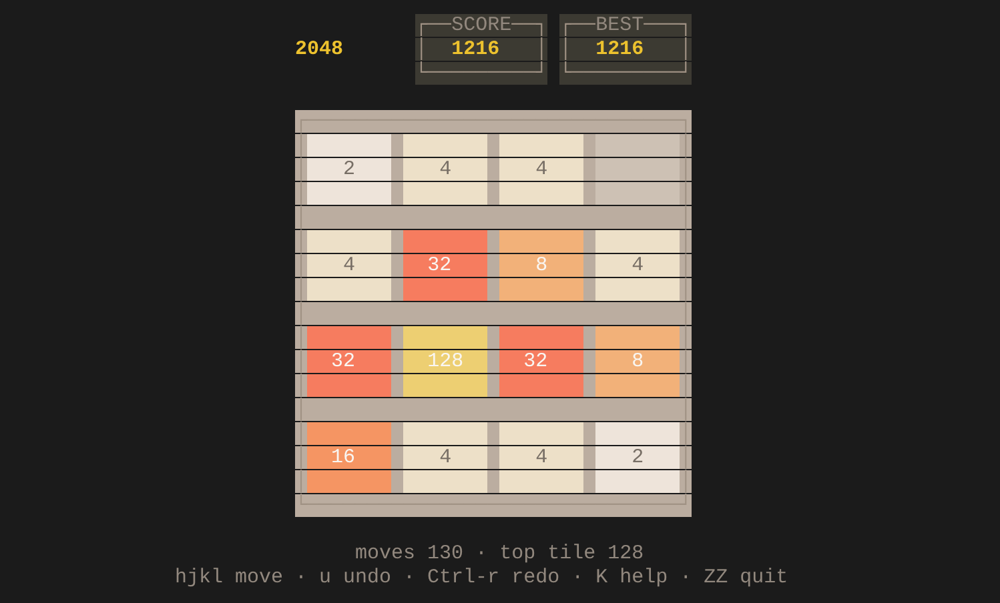

# t2048 — 终端版 2048

[](https://github.com/microfatrat/t2048/actions/workflows/ci.yml)
[](https://github.com/microfatrat/t2048/actions/workflows/release.yml)
[](https://github.com/microfatrat/t2048/actions/workflows/audit.yml)

用 Rust + [ratatui](https://ratatui.rs) 写的 2048，直接在终端里玩。

当前版本 **1.0.1**，变更见 [更新日志](CHANGELOG.md)。



## 特性

- 经典 4×4 规则：相同数字合并，每次**有效**移动后随机生成一个新方块（90% 是 2，10% 是 4）
- **vim 风格的按键**：`hjkl` 移动、`[count]` 重复、`u` / `Ctrl-r` 撤销重做、`K` 求助、`ZZ` / `ZQ` 退出
- 撤销 + 重做，可以一路退到开局再走回来
- 最高分自动保存到磁盘，下次启动自动读取
- 到达 2048 后可以选择继续玩下去
- 真彩色经典配色；设置 `NO_COLOR` 或用 `--mono` 时自动回退到 256 色
- 布局随窗口自适应，窗口过小会明确提示而不是画出乱码
- 退出 / panic 时都会恢复终端状态（退出备用屏幕、恢复光标、关闭 raw 模式）
- 只有一个可执行文件，运行时无额外依赖

## 安装

### 预编译二进制

每个 `v*` 版本都会在 [GitHub Releases](https://github.com/microfatrat/t2048/releases) 提供三个平台的二进制：

| 平台 | 文件 |
| --- | --- |
| Linux x86_64 | `t2048-x86_64-unknown-linux-gnu` |
| Windows x86_64 | `t2048-x86_64-pc-windows-msvc.exe` |
| macOS (Apple Silicon) | `t2048-aarch64-apple-darwin` |

以 Linux 为例：

```bash
curl -LO https://github.com/microfatrat/t2048/releases/latest/download/t2048-x86_64-unknown-linux-gnu
chmod +x t2048-x86_64-unknown-linux-gnu
./t2048-x86_64-unknown-linux-gnu
```

发布产物附带 `SHA256SUMS`，下载后可以校验。

### 从源码构建

```bash
cargo run --release
```

安装到 `~/.cargo/bin`：

```bash
cargo install --path .
t2048
```

要求：Rust 1.88 或更高（使用了 edition 2024 的 let-chains）。终端至少 **33 × 24**。

## 平台支持

底层依赖 [ratatui](https://ratatui.rs) + [crossterm](https://github.com/crossterm-rs/crossterm)，两者都官方支持 Linux / macOS / Windows。源码里唯一一处平台分支是最高分的存放位置（见下），其余代码不分平台。

本仓库的验证情况：

| 平台 | 验证方式 | 结果 |
| --- | --- | --- |
| Linux x86_64 | `cargo build --release`、真实 pty 交互测试、`cargo test`、GitHub Actions CI | ✅ 99 个测试通过 |
| Windows x86_64 (MSVC) | GitHub Actions CI 在 `windows-latest` 上运行 `cargo test` 与 release 构建 | ✅ CI 通过 |
| macOS (Apple Silicon) | GitHub Actions CI 在 `macos-latest` 上运行 `cargo test` 与 release 构建 | ✅ CI 通过 |

macOS Intel（`x86_64-apple-darwin`）没有单独验证；它和 Linux 走的是同一套代码路径。

最高分的存放位置按平台区分：

- Linux / macOS：`$XDG_DATA_HOME/t2048/best`，否则 `~/.local/share/t2048/best`
- Windows：`%APPDATA%\t2048\best`，没有 `APPDATA` 时退回 `%USERPROFILE%\AppData\Roaming\t2048\best`

写不进去（只读磁盘、没有 HOME 等）时会静默跳过，不影响游戏。

配色默认用真彩色；Windows Terminal、macOS Terminal.app、iTerm2、各 Linux 终端都支持。老式终端（比如没开 VT 处理的 conhost 配点阵字体）可能出现方框线或箭头显示成方块，这种情况用 `--mono` 换 256 色也不能解决字形缺失，属于终端字体问题。

## 操作

按键映射按 vim 的习惯来：凡是 vim 里有对应操作的都用 vim 的键。

| 按键 | 作用 | vim 里的含义 |
| --- | --- | --- |
| `h` `j` `k` `l` | 左 / 下 / 上 / 右 | 同 vim 的移动键 |
| `←` `↑` `↓` `→` | 同上 | 方便不想离开方向键的人 |
| `[数字]` + 其他键 | 重复若干次：`3j` 下移 3 次、`3u` 撤销 3 步、`2Ctrl-r` 重做 2 步 | vim 的 `[count]` |
| `u` | 撤销 | 同 vim |
| `Ctrl-r` | 重做 | 同 vim |
| `K` / `?` / `F1` | 按键说明 | `K` 是 vim 的「查文档」键 |
| `ZZ` | 保存最高分并退出 | 同 vim 的「保存并退出」 |
| `ZQ` | 退出，不保存最高分 | 同 vim 的「不保存退出」 |
| `r` | 重新开始 | vim 里 `r` 是替换字符，这里没有对应操作，沿用游戏习惯 |
| `c` / `Enter` / `Space` | 胜利后继续玩 | — |
| `q` / `Esc` / `Ctrl-C` | 退出 | 终端 TUI 的通用习惯 |

几处细节都照着 vim 来：

- 大写 `H` `J` `K` `L` **不是**移动键（vim 里它们是另外的命令），其中 `K` 用来开帮助。
- 前导 `0` 不算 count，所以单独按 `0` 什么也不做；但 `10` 是合法的 count。
- 输入 count 的过程中按 `Esc` 只取消 count，不会退出；没有 count 时 `Esc` 才退出。
- `Z` 后面跟的不是 `Z` 或 `Q` 时，整串命令作废、什么也不做（和 vim 遇到未知命令一样）。
- 撤销之后一旦再走一步，重做链就丢弃了 —— 和 vim 一致。
- count 对移动、`u`、`Ctrl-r` 都生效（`3u` 就是撤销 3 步），对 `r`、`c`、`q` 这类没有"重复"含义的键则被忽略。
- 正在输入的 count 会像 vim 的 `showcmd` 一样显示在右下角。

原来的 `wasd` 已经去掉，避免和 vim 键位混淆。

## 命令行参数

```
t2048 [OPTIONS]

-h, --help        显示帮助
    --mono        使用 256 色配色（等价于设置 NO_COLOR）
    --no-color    --mono 的别名
    --seed <N>    固定随机种子，便于复现某局游戏
```

`--seed` 也接受 `--seed=N` 的写法。

## 代码结构

代码分成「与终端无关的逻辑」和「渲染」两部分，因此规则可以脱离终端完整测试：

| 文件 | 职责 |
| --- | --- |
| `src/game.rs` | 全部游戏规则：滑动、合并、计分、胜负判定。不引用 ratatui |
| `src/app.rs` | 应用状态机：把按键翻译成动作，管理重绘与动画计时 |
| `src/ui.rs` | 用 ratatui 绘制棋盘、分数框、弹窗 |
| `src/theme.rs` | 配色表（真彩色 + 256 色两套） |
| `src/storage.rs` | 最高分读写，全部是「失败也不影响游戏」的尽力而为 |
| `src/main.rs` | 二进制入口：解析参数、初始化终端、事件循环 |
| `src/lib.rs` | 把上面这些模块暴露成库 |

## 测试

```bash
cargo fmt --all -- --check
cargo clippy --all-targets -- -D warnings
cargo test      # 99 个测试
```

测试覆盖了三类内容：

1. **规则**：合并只发生一次（`[2,2,2,2]` → `[4,4,0,0]` 而不是 `[8,0,0,0]`）、四个方向、无变化的移动不计分也不生成新块、滑动前后数字总和不变、胜负判定、撤销 / 重做、最高分不会被降低。
2. **按键**：`hjkl` 映射、方向键别名、大写 `HJKL` 不是移动键、`wasd` 已失效、`[count]` 等价于连按若干次、前导 `0` 不算 count、count 上限、`Esc` 先取消 count、`Ctrl-r` 是重做而非重开、`ZZ` / `ZQ` / `Z` 后跟其他键的行为。
3. **渲染**：用 ratatui 的 `TestBackend` 把界面画进内存缓冲区并断言内容 —— 起始两块数字出现、弹窗不被截断、count 显示在右下角、33×24 的最小窗口能正常显示、小窗口给出提示、连打 300 步不 panic。

## 实现要点

- **滑动与合并**：`apply_move` 按方向把每一行/列读成一条「朝目标方向的线」，复用同一个 `slide_line`：先压缩掉空格，再让相邻相等的一对合并，合并后的方块当次不再参与合并。四个方向共用一套坐标映射（`cell_at`），避免写四份几乎相同的代码。
- **随机性**：`Game::with_seed` 用 `StdRng::seed_from_u64` 构造，所以整局游戏完全可复现，测试不需要 mock。
- **撤销 / 重做**：`game.rs` 维护 `history` 和 `future` 两个快照栈，快照里连 `moves` 计数一起存，所以撤销和重做都能精确还原。任何一次新移动都会清空 `future`，与 vim 丢弃重做分支的规则一致。重做有可能落在一个已经结束的局面，所以还原后会重新判定胜负，而不是假定还能继续走。
- **count 的实现**：`App` 里只存一个待执行的数字，遇到移动键时把它当作「重复这个动作多少次」；因为重复同一个方向时若某次没改变棋盘，后面也不可能改变，所以提前退出循环。
- **渲染**：每个方块是一个 7×3 的矩形，先把整块填成对应背景色，再把数字居中画在中间一行；方块之间留 1 格空隙，露出棋盘底色。刚生成的方块会高亮几帧。结束 / 帮助浮层与棋盘同宽并居中于棋盘，这样左右边框正好对齐。
- **重绘**：只在状态真的变化时才调用 `terminal.draw`；没有动画时轮询间隔放宽到 1 秒，生成高亮期间才按 60ms 走动画帧，空闲时几乎不占 CPU。

## 许可证

MIT，见 [LICENSE](LICENSE)。

